# Memory Game

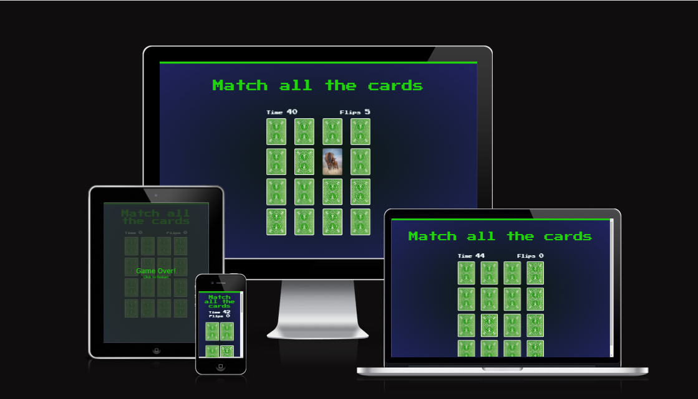

## 1. Purpose of the project

The purpose of this project was to create a memory game.
The game has been implemented with several functions that handle different aspects of the game. These functions are responsible for shuffling images, handling game state, and checking for matches.

### How to Play

1. Click anywhere on the game screen to start the game.
2. Click on any image to flip it and reveal the picture.
3. Click on another image to reveal its picture.
4. If the pictures on the images match, they will remain face-up and you will earn points. If they don't match, they will be flipped back over and you can continue playing.
5. Keep playing until you have found all the pairs or until the time runs out.
6. If you successfully find all the pairs before the time runs out, you win the game!

## 2 Users Stories

- As a user, I want to have information about the instructions of the game

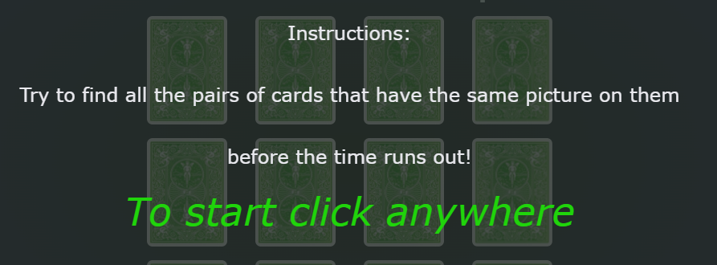

- As a user, I prefer to play an interactive game that asks me to complete a 
task within a certain time interval

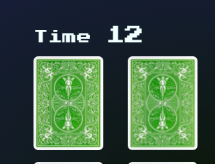

- As a user, I would like to know how many flips I used

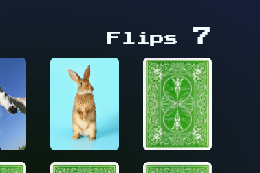

- As a user, I would like to know what happens if the returned images do match

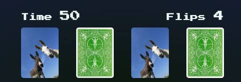

- As a user, I would like to know what happens if the returned images do not match

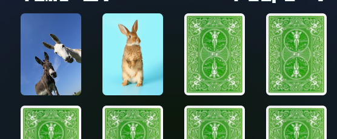

- As a user  I would like to know what happens if I manage to turn all the images

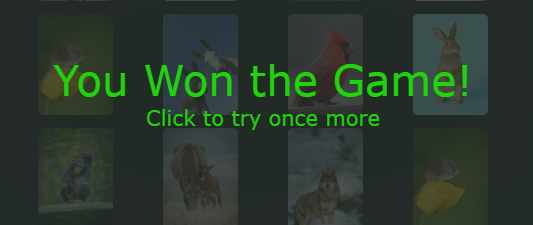

- As a user, I would like to know what happens if I fail to turn all the images

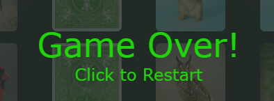

## 3. Features:
- Randomly shuffled images for a unique game every time.
- A timer to add an element of challenge and excitement.
- A counter to keep track of the number of flips made.
- An overlay text that appears at the start of the game to give instructions and disappears once the game begins.
- An overlay text that appears when the game is won or lost.

## 4. future features:

- I would like to add the audio part to make the game more interactive

## 5. Typography and color scheme:

- I used a very simple design. I applied a radial gradient for the background by combining two colors (#0b180a, #212361) to match the text color (#20d40b) of the title. For the smaller text that displays the time and flip number I used a light color (#e9e9ee)

- I chose the image on the back of the images to be green to match the main title.

## 6. Technologies Used

- HTML
- CSS
- JavaScript
- GitPod
- GitHub
- Visual Studio

## 7. Testing

### User Stories:
- As a user, when I load the page, I see a message telling me that I have to click to start the game, this message is displayed on a transparent background and behind it is a game with several images

  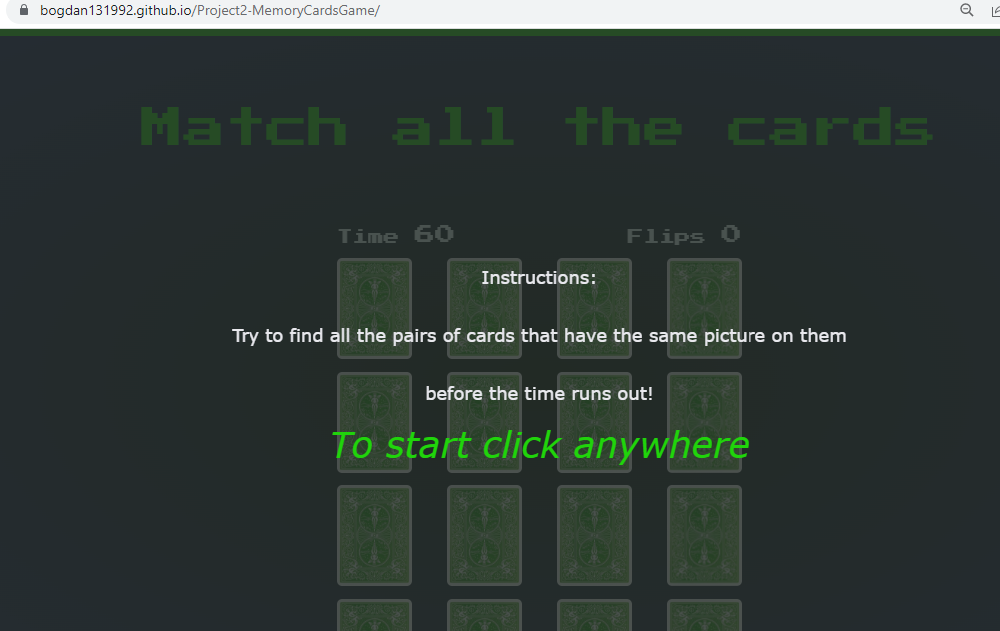

- As a user, when I click on the screen, the message with a transparent background disappears and I see a game that has a time of 60 seconds that decreases and the title tells me to match all the images

- As a user, when I click on a image it turns around and shows me an image, the number of flips is recorded and displayed on the right side above the game

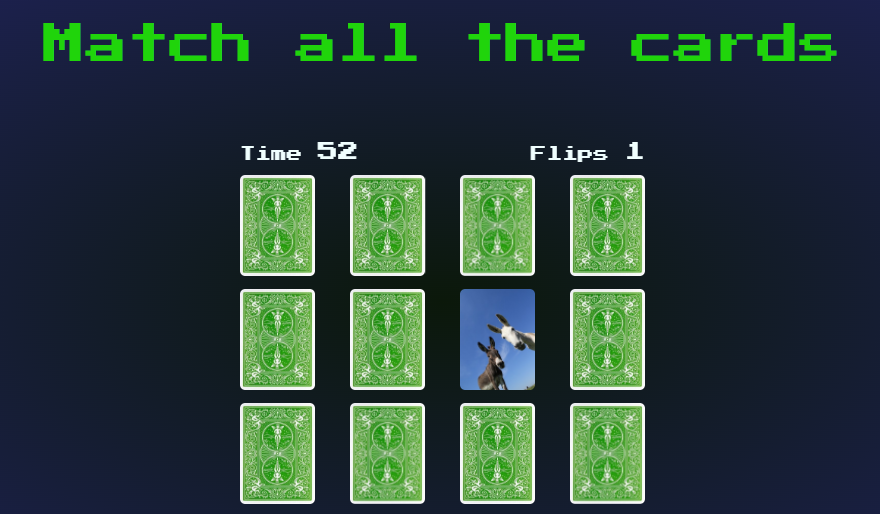

- As a user, when I click on another image, if it's the same as the first one, they both stay facing away, if they have different images, they turn back.

- As a user, when I turn over all the images in pairs of two of the same kind, I am greeted by a message on a transparent background that overlaps the game and which informs me that I have won, and gives me the opportunity to restart the game

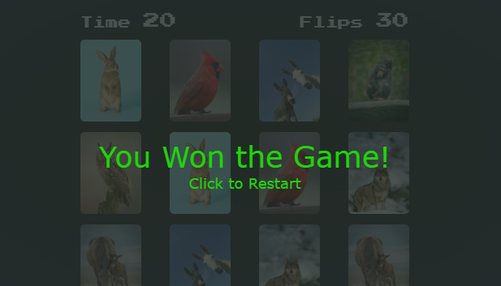

- As a user, if I do not manage to turn over all the images in 6o seconds, I am greeted by a message that informs me that the game is over and gives me the opportunity to restart the game

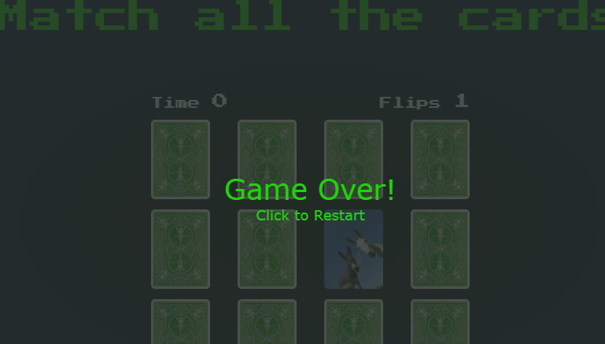

### Lighthouse check

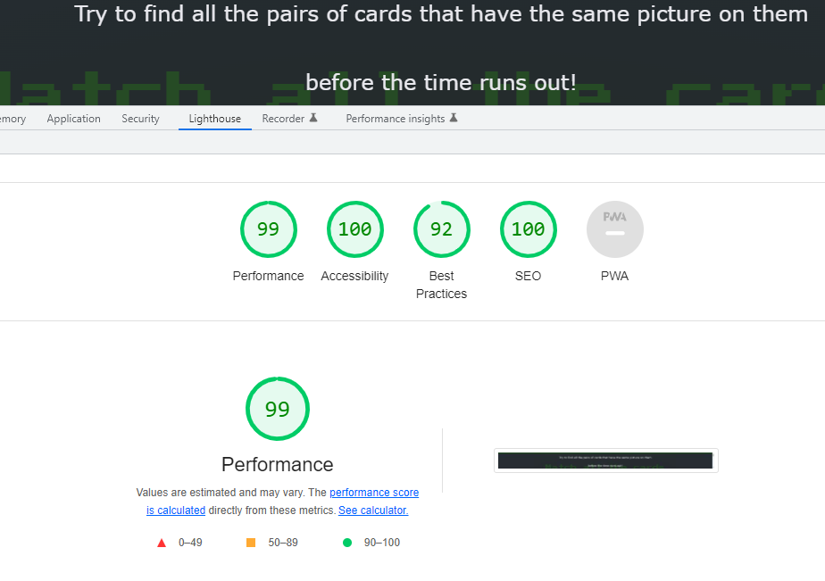

#### code validation

- [HTML Validator](https://validator.w3.org/nu/?doc=https%3A%2F%2Fbogdan131992.github.io%2FProject2-MemoryCardsGame%2F)

- [W3C CSS Validator](https://jigsaw.w3.org/css-validator/validator?uri=https%3A%2F%2Fbogdan131992.github.io%2FProject2-MemoryCardsGame%2F&profile=css3svg&usermedium=all&warning=1&vextwarning=&lang=en)

- Java Script code was tested for errors on [jshint](https://jshint.com/) and has no error

### fixed bugs

- During the validation test, the HTML code returned an error because we had an extra closing tag for a p element

- I deleted the extra closing tag to fix the code

## supported screens

- I used media queries (@media screen and (max-width:600px))
- below 600 px, the playing images are displayed only on two columns, and the size of the titles decreases.
- To create a responsive website for all devices

## 8. Deployment

### On Github:

- The project was deployed on GitHub, after I created a new repository and wrote the program in Git Pod, I selected my project in Git Hub repository, after this I selected my project from the menu on the left.

- Then I clicked on Settings and from the settings menu on the left I clicked on the Pages button

- Then from the Branch section I chose "main".

- At the end, I entered the domain name bogdan131992.github.io in Custom domain

- I clicked on save.

- I was informed that the deployment process was successful and I received a link for my website

### On Gitpod:

From the github page I select my project, then I click on Gitpod green button.
- Then I selected New Workspace and then entered in the online programming environment.
- From the menu on the left, I selected the option to create new files and created the necessary files for the project
- In a folder I put all the necessary images that I downloaded from the Internet
- I entered the command python -m http.server in the terminal to open a live server
- To save the changes, I entered the git add command in the terminal
- Also I used in the terminal  git commit -m "" to commit the changes 
- And then to push the changes to Github I used the git push command in the terminal.

[Gitpod - live link](https://bogdan131992.github.io/Project2-MemoryCardsGame/)

[Github ](https://github.com/Bogdan131992/Project2-MemoryCardsGame)

## 9. credits

### Content

- To implement this game and to understand the algorithms behind the game, I was inspired by two projects that I found on YouTube.

- For the structure of the program in HTML, especially the arrangement of the playing images, I was inspired by the project presented by WebDevSimplified and by freeCodeCamp.

- For the functional part of Java Script as well as for how to apply the styles, I would use the videos presented by the YouTube channels WebDev and Port Exe.

- I tried as much as possible not to duplicate the code presented in these projects, by choosing other names as well as by implementing the Java Script part differently, i.e. instead of classes I used functions.

- [freeCodeCamp](https://www.youtube.com/watch?v=ZniVgo8U7ek)

- [portExe](https://www.youtube.com/watch?v=3uuQ3g92oPQ)

- [WebDevSimplified](https://www.youtube.com/watch?v=28VfzEiJgy4)

### Images

- [img1.jpeg](https://stock.adobe.com/ie/images/portrait-of-two-funny-donkeys-black-and-white/293791323?asset_id=293791323)

- [img2.jpeg](https://stock.adobe.com/ie/images/cute-fluffy-rabbit-on-color-background/411745360?asset_id=411745360)

- [img3.jpeg](https://stock.adobe.com/ie/images/cardinal-on-a-brown-plank/84805167?asset_id=84805167)

- [img4.jpeg](https://stock.adobe.com/ie/images/european-wolf-in-winter-canis-lupus/461415700)

- [img5.jpeg](https://stock.adobe.com/ie/images/chimpanzee-consists-of-two-extant-species-common-chimpanzee-and-bonobo-bonobos-and-common-chimpanzees-are-the-only-species-of-great-apes-that-are-currently-restricted-in-their-range-to-africa/305259897)

- [img6.jpeg](https://stock.adobe.com/ie/images/mare-with-young-colt/215104218)

- [img7.jpeg](https://stock.adobe.com/ie/images/long-eared-owl-asio-otus/171955612)

- [img8.jpeg](https://stock.adobe.com/ie/images/adorable-cute-harvest-mice-micromys-minutus-on-yellow-tulip-flower-foliage-with-neutral-green-nature-background/287897661?asset_id=287897661)
- [backimage.jpg](https://www.jucariesimagie.ro/4939-large_01bold/bicycle-verde-carti-de-joc.jpg)
